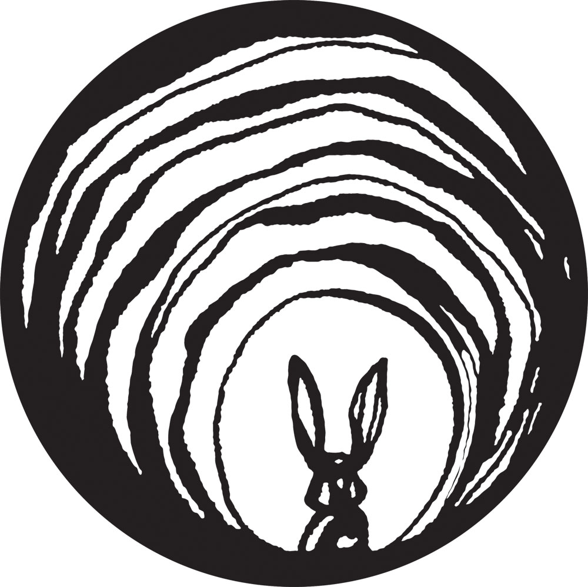

# AR Explorations
## In this repo I summoned all the works I've ever done with AR using ViroReact and ARKit.

#### Pose Detection
This app shows how to apply CoreML to track human's bodily structure using heatmapping and custom joint calculation model.

#### ARPokerDice
is an AR game similar to dice in [real life](https://media.giphy.com/media/xR2SI8vqfQMLe/giphy.gif)

#### Augmented Heart Billboard

#### KioskAd 
AR QR Code Reader, Billboard

#### Portal
Futuristic Portal to virtual world through AR

#### Occlusion
Was meant to show ARKit2 feature of real-object occlusion with respective projected virtual subjects
